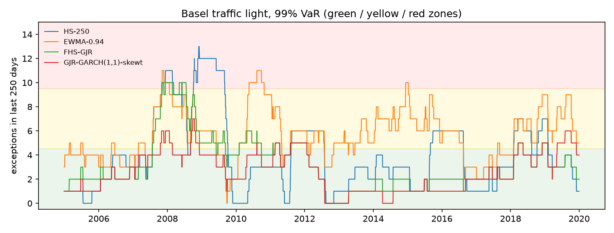

# Backtests: development period

4,027 one-day-ahead forecasts per model (2004-2019). Tests at the 5% level. The locked test period is not used.

## Summary

| model | Kupiec 99.0% | indep. 99.0% | cond. cov. 99.0% | Kupiec 97.5% | indep. 97.5% | cond. cov. 97.5% | Z2 97.5% | McNeil-Frey 97.5% | rejections |
|---|---|---|---|---|---|---|---|---|---|
| HS-250 | REJECT | REJECT | REJECT | REJECT | REJECT | REJECT | REJECT | REJECT | 8 |
| EWMA-0.94 | REJECT | pass | REJECT | REJECT | pass | REJECT | REJECT | REJECT | 6 |
| GARCH(1,1)-normal | REJECT | pass | REJECT | REJECT | pass | REJECT | REJECT | REJECT | 6 |
| GARCH(1,1)-t | REJECT | pass | REJECT | REJECT | pass | REJECT | REJECT | pass | 5 |
| GARCH(1,1)-skewt | pass | pass | pass | REJECT | pass | REJECT | REJECT | pass | 3 |
| GJR-GARCH(1,1)-normal | REJECT | pass | REJECT | REJECT | pass | REJECT | REJECT | REJECT | 6 |
| FHS-GJR | pass | pass | pass | pass | pass | pass | pass | pass | 0 |
| GJR-GARCH(1,1)-t | REJECT | pass | REJECT | REJECT | pass | REJECT | REJECT | pass | 5 |
| GJR-GARCH(1,1)-skewt | pass | pass | pass | pass | pass | pass | pass | pass | 0 |

With 9 models and 8 tests each, a few rejections at the 5% level would occur by chance even if every model were correct, so single borderline rejections should not be over-interpreted.

## VaR 99.0%

| model | exceptions | expected | rate | Kupiec p | independence p | cond. coverage p | P(hit after a hit) | green windows | yellow | red | worst window |
|---|---|---|---|---|---|---|---|---|---|---|---|
| HS-250 | 61 | 40.3 | 1.51% | 0.0023 | 0.0023 | 9.1e-05 | 8.2% | 67% | 24% | 8% | 13 |
| EWMA-0.94 | 90 | 40.3 | 2.23% | 1.2e-11 | 0.0678 | 2.0e-11 | 5.6% | 32% | 63% | 5% | 11 |
| GARCH(1,1)-normal | 100 | 40.3 | 2.48% | 1.7e-15 | 0.3630 | 1.2e-14 | 4.0% | 25% | 66% | 9% | 16 |
| GARCH(1,1)-t | 67 | 40.3 | 1.66% | 0.0001 | 0.1312 | 0.0002 | 4.5% | 59% | 39% | 2% | 11 |
| GARCH(1,1)-skewt | 52 | 40.3 | 1.29% | 0.0754 | 0.1824 | 0.0846 | 3.8% | 73% | 27% | 0% | 8 |
| GJR-GARCH(1,1)-normal | 89 | 40.3 | 2.21% | 2.8e-11 | 0.9811 | 2.4e-10 | 2.2% | 41% | 49% | 10% | 16 |
| FHS-GJR | 50 | 40.3 | 1.24% | 0.1375 | 0.6541 | 0.3003 | 2.0% | 76% | 21% | 3% | 10 |
| GJR-GARCH(1,1)-t | 61 | 40.3 | 1.51% | 0.0023 | 0.9370 | 0.0095 | 1.6% | 70% | 26% | 3% | 11 |
| GJR-GARCH(1,1)-skewt | 41 | 40.3 | 1.02% | 0.9082 | 0.4391 | 0.7364 | 2.4% | 86% | 14% | 0% | 7 |

Traffic light: share of rolling 250-day windows with 0-4 exceptions (green), 5-9 (yellow) and 10 or more (red).

## VaR 97.5%

| model | exceptions | expected | rate | Kupiec p | independence p | cond. coverage p | P(hit after a hit) |
|---|---|---|---|---|---|---|---|
| HS-250 | 136 | 100.7 | 3.38% | 0.0007 | 0.0080 | 9.5e-05 | 8.1% |
| EWMA-0.94 | 156 | 100.7 | 3.87% | 2.3e-07 | 0.2412 | 7.7e-07 | 5.8% |
| GARCH(1,1)-normal | 157 | 100.7 | 3.90% | 1.4e-07 | 0.4493 | 7.3e-07 | 5.1% |
| GARCH(1,1)-t | 151 | 100.7 | 3.75% | 2.2e-06 | 0.1771 | 5.4e-06 | 6.0% |
| GARCH(1,1)-skewt | 135 | 100.7 | 3.35% | 0.0010 | 0.2632 | 0.0023 | 5.2% |
| GJR-GARCH(1,1)-normal | 153 | 100.7 | 3.80% | 9.0e-07 | 0.7195 | 5.4e-06 | 3.3% |
| FHS-GJR | 109 | 100.7 | 2.71% | 0.4069 | 0.9767 | 0.7087 | 2.8% |
| GJR-GARCH(1,1)-t | 149 | 100.7 | 3.70% | 5.2e-06 | 0.8322 | 3.0e-05 | 4.0% |
| GJR-GARCH(1,1)-skewt | 116 | 100.7 | 2.88% | 0.1308 | 0.8446 | 0.3133 | 2.6% |

## ES 97.5%

| model | Z2 | Z2 p | mean exceedance residual | McNeil-Frey p |
|---|---|---|---|---|
| HS-250 | -0.4360 | 0.0002 | 0.0630 | 0.0162 |
| EWMA-0.94 | -0.8400 | 0.0002 | 0.1874 | 0.0002 |
| GARCH(1,1)-normal | -0.7922 | 0.0002 | 0.1492 | 0.0002 |
| GARCH(1,1)-t | -0.5395 | 0.0002 | 0.0264 | 0.1272 |
| GARCH(1,1)-skewt | -0.3427 | 0.0016 | 0.0013 | 0.4634 |
| GJR-GARCH(1,1)-normal | -0.7085 | 0.0002 | 0.1242 | 0.0002 |
| FHS-GJR | -0.1151 | 0.1444 | 0.0300 | 0.1256 |
| GJR-GARCH(1,1)-t | -0.5097 | 0.0002 | 0.0201 | 0.2012 |
| GJR-GARCH(1,1)-skewt | -0.1517 | 0.0774 | -0.0005 | 0.4764 |

Z2 < 0 and a positive mean exceedance residual both indicate that ES is too low. p-values are one-sided (small when ES is underestimated), from a studentized bootstrap.

