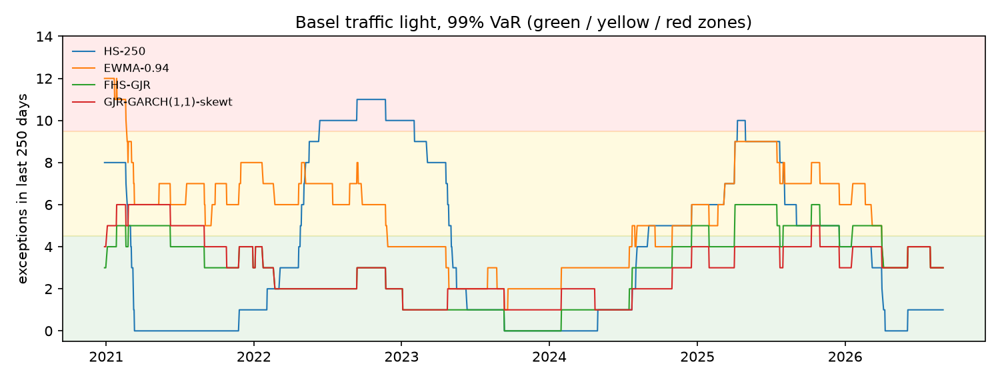

# Backtests: locked test period

1,674 one-day-ahead forecasts per model (2020-01-02 to 2026-08-31). Tests at the 5% level. This is the one-time evaluation on the locked test period, with every setting fixed during development.

## Summary

| model | Kupiec 99.0% | indep. 99.0% | cond. cov. 99.0% | Kupiec 97.5% | indep. 97.5% | cond. cov. 97.5% | Z2 97.5% | McNeil-Frey 97.5% | rejections |
|---|---|---|---|---|---|---|---|---|---|
| HS-250 | REJECT | REJECT | REJECT | REJECT | REJECT | REJECT | REJECT | REJECT | 8 |
| EWMA-0.94 | REJECT | pass | REJECT | REJECT | pass | REJECT | REJECT | REJECT | 6 |
| GARCH(1,1)-normal | REJECT | pass | REJECT | REJECT | pass | REJECT | REJECT | REJECT | 6 |
| GARCH(1,1)-t | REJECT | pass | REJECT | REJECT | pass | REJECT | REJECT | REJECT | 6 |
| GARCH(1,1)-skewt | pass | pass | pass | pass | pass | pass | REJECT | pass | 1 |
| GJR-GARCH(1,1)-normal | REJECT | pass | REJECT | REJECT | pass | REJECT | REJECT | REJECT | 6 |
| FHS-GJR | pass | pass | pass | pass | pass | pass | pass | pass | 0 |
| GJR-GARCH(1,1)-t | REJECT | pass | REJECT | REJECT | pass | pass | REJECT | REJECT | 5 |
| GJR-GARCH(1,1)-skewt | pass | pass | pass | pass | pass | pass | pass | REJECT | 1 |

With 9 models and 8 tests each, a few rejections at the 5% level would occur by chance even if every model were correct, so single borderline rejections should not be over-interpreted.

## VaR 99.0%

| model | exceptions | expected | rate | Kupiec p | independence p | cond. coverage p | P(hit after a hit) | green windows | yellow | red | worst window |
|---|---|---|---|---|---|---|---|---|---|---|---|
| HS-250 | 30 | 16.7 | 1.79% | 0.0034 | 0.0016 | 9.3e-05 | 13.3% | 56% | 32% | 12% | 11 |
| EWMA-0.94 | 40 | 16.7 | 2.39% | 1.3e-06 | 0.3373 | 5.0e-06 | 5.0% | 39% | 59% | 3% | 12 |
| GARCH(1,1)-normal | 40 | 16.7 | 2.39% | 1.3e-06 | 0.9638 | 7.9e-06 | 2.5% | 30% | 62% | 7% | 11 |
| GARCH(1,1)-t | 29 | 16.7 | 1.73% | 0.0064 | 0.5278 | 0.0198 | 3.4% | 55% | 45% | 0% | 8 |
| GARCH(1,1)-skewt | 25 | 16.7 | 1.49% | 0.0587 | 0.3869 | 0.1151 | 4.0% | 70% | 30% | 0% | 7 |
| GJR-GARCH(1,1)-normal | 35 | 16.7 | 2.09% | 9.1e-05 | 0.7616 | 0.0005 | 2.9% | 33% | 67% | 0% | 9 |
| FHS-GJR | 20 | 16.7 | 1.19% | 0.4372 | 0.2368 | 0.3673 | 5.0% | 76% | 24% | 0% | 6 |
| GJR-GARCH(1,1)-t | 28 | 16.7 | 1.67% | 0.0117 | 0.4912 | 0.0328 | 3.6% | 55% | 45% | 0% | 8 |
| GJR-GARCH(1,1)-skewt | 20 | 16.7 | 1.19% | 0.4372 | 0.4866 | 0.5805 | 0.0% | 87% | 13% | 0% | 6 |

Traffic light: share of rolling 250-day windows with 0-4 exceptions (green), 5-9 (yellow) and 10 or more (red).

## VaR 97.5%

| model | exceptions | expected | rate | Kupiec p | independence p | cond. coverage p | P(hit after a hit) |
|---|---|---|---|---|---|---|---|
| HS-250 | 57 | 41.9 | 3.41% | 0.0244 | 0.0140 | 0.0039 | 10.5% |
| EWMA-0.94 | 71 | 41.9 | 4.24% | 3.2e-05 | 0.9937 | 0.0002 | 4.2% |
| GARCH(1,1)-normal | 68 | 41.9 | 4.06% | 0.0002 | 0.8838 | 0.0008 | 4.4% |
| GARCH(1,1)-t | 60 | 41.9 | 3.58% | 0.0076 | 0.9136 | 0.0281 | 3.3% |
| GARCH(1,1)-skewt | 51 | 41.9 | 3.05% | 0.1658 | 0.7236 | 0.3596 | 3.9% |
| GJR-GARCH(1,1)-normal | 61 | 41.9 | 3.64% | 0.0050 | 0.8740 | 0.0191 | 3.3% |
| FHS-GJR | 41 | 41.9 | 2.45% | 0.8938 | 0.3670 | 0.6599 | 4.9% |
| GJR-GARCH(1,1)-t | 56 | 41.9 | 3.35% | 0.0350 | 0.4316 | 0.0796 | 5.4% |
| GJR-GARCH(1,1)-skewt | 42 | 41.9 | 2.51% | 0.9813 | 0.3981 | 0.6995 | 4.8% |

## ES 97.5%

| model | Z2 | Z2 p | mean exceedance residual | McNeil-Frey p |
|---|---|---|---|---|
| HS-250 | -0.5701 | 0.0014 | 0.1528 | 0.0010 |
| EWMA-0.94 | -1.0018 | 0.0002 | 0.1800 | 0.0002 |
| GARCH(1,1)-normal | -0.9313 | 0.0002 | 0.1886 | 0.0002 |
| GARCH(1,1)-t | -0.5582 | 0.0020 | 0.0869 | 0.0188 |
| GARCH(1,1)-skewt | -0.3045 | 0.0416 | 0.0705 | 0.0548 |
| GJR-GARCH(1,1)-normal | -0.7784 | 0.0002 | 0.2201 | 0.0004 |
| FHS-GJR | -0.0375 | 0.3942 | 0.0590 | 0.1254 |
| GJR-GARCH(1,1)-t | -0.4851 | 0.0046 | 0.1099 | 0.0130 |
| GJR-GARCH(1,1)-skewt | -0.1178 | 0.2384 | 0.1138 | 0.0180 |

Z2 < 0 and a positive mean exceedance residual both indicate that ES is too low. p-values are one-sided (small when ES is underestimated), from a studentized bootstrap.

