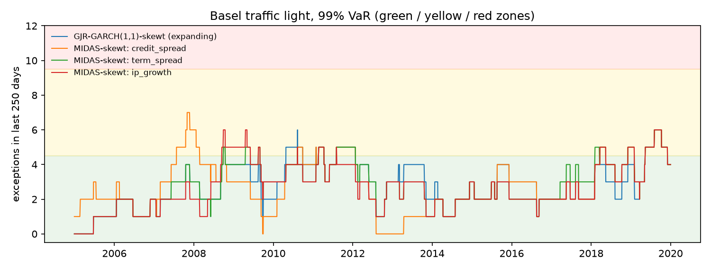

# Backtests: development period

4,027 one-day-ahead forecasts per model (2004-2019). Tests at the 5% level. The locked test period is not used.

## Summary

| model | Kupiec 99.0% | indep. 99.0% | cond. cov. 99.0% | Kupiec 97.5% | indep. 97.5% | cond. cov. 97.5% | Z2 97.5% | McNeil-Frey 97.5% | rejections |
|---|---|---|---|---|---|---|---|---|---|
| GJR-GARCH(1,1)-skewt (expanding) | pass | pass | pass | pass | pass | pass | pass | pass | 0 |
| MIDAS-skewt: credit_spread | pass | pass | pass | pass | pass | pass | pass | pass | 0 |
| MIDAS-skewt: term_spread | pass | pass | pass | pass | pass | pass | pass | REJECT | 1 |
| MIDAS-skewt: ip_growth | pass | pass | pass | pass | pass | pass | pass | pass | 0 |

With 4 models and 8 tests each, a few rejections at the 5% level would occur by chance even if every model were correct, so single borderline rejections should not be over-interpreted.

## VaR 99.0%

| model | exceptions | expected | rate | Kupiec p | independence p | cond. coverage p | P(hit after a hit) | green windows | yellow | red | worst window |
|---|---|---|---|---|---|---|---|---|---|---|---|
| GJR-GARCH(1,1)-skewt (expanding) | 44 | 40.3 | 1.09% | 0.5605 | 0.0960 | 0.2112 | 4.5% | 89% | 11% | 0% | 6 |
| MIDAS-skewt: credit_spread | 44 | 40.3 | 1.09% | 0.5605 | 0.0960 | 0.2112 | 4.5% | 85% | 15% | 0% | 7 |
| MIDAS-skewt: term_spread | 44 | 40.3 | 1.09% | 0.5605 | 0.5078 | 0.6780 | 2.3% | 88% | 12% | 0% | 6 |
| MIDAS-skewt: ip_growth | 42 | 40.3 | 1.04% | 0.7856 | 0.4616 | 0.7349 | 2.4% | 88% | 12% | 0% | 6 |

Traffic light: share of rolling 250-day windows with 0-4 exceptions (green), 5-9 (yellow) and 10 or more (red).

## VaR 97.5%

| model | exceptions | expected | rate | Kupiec p | independence p | cond. coverage p | P(hit after a hit) |
|---|---|---|---|---|---|---|---|
| GJR-GARCH(1,1)-skewt (expanding) | 111 | 100.7 | 2.76% | 0.3051 | 0.9716 | 0.5907 | 2.7% |
| MIDAS-skewt: credit_spread | 107 | 100.7 | 2.66% | 0.5273 | 0.5057 | 0.6562 | 3.7% |
| MIDAS-skewt: term_spread | 103 | 100.7 | 2.56% | 0.8151 | 0.8213 | 0.9485 | 2.9% |
| MIDAS-skewt: ip_growth | 103 | 100.7 | 2.56% | 0.8151 | 0.6755 | 0.8914 | 1.9% |

## ES 97.5%

| model | Z2 | Z2 p | mean exceedance residual | McNeil-Frey p |
|---|---|---|---|---|
| GJR-GARCH(1,1)-skewt (expanding) | -0.1431 | 0.0884 | 0.0368 | 0.0848 |
| MIDAS-skewt: credit_spread | -0.0991 | 0.1718 | 0.0342 | 0.1016 |
| MIDAS-skewt: term_spread | -0.0811 | 0.2196 | 0.0567 | 0.0224 |
| MIDAS-skewt: ip_growth | -0.0616 | 0.2746 | 0.0376 | 0.0762 |

Z2 < 0 and a positive mean exceedance residual both indicate that ES is too low. p-values are one-sided (small when ES is underestimated), from a studentized bootstrap.

