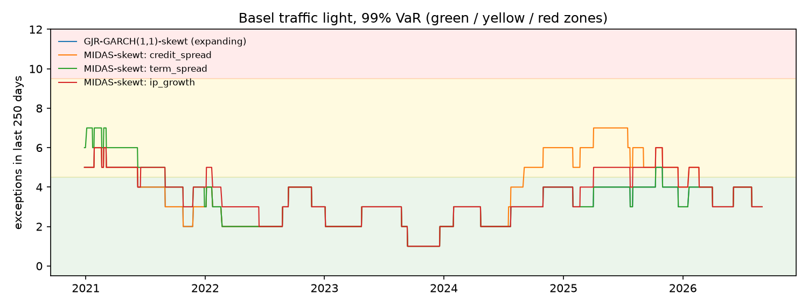

# Backtests: locked test period

1,674 one-day-ahead forecasts per model (2020-01-02 to 2026-08-31). Tests at the 5% level. This is the one-time evaluation on the locked test period, with every setting fixed during development.

## Summary

| model | Kupiec 99.0% | indep. 99.0% | cond. cov. 99.0% | Kupiec 97.5% | indep. 97.5% | cond. cov. 97.5% | Z2 97.5% | McNeil-Frey 97.5% | rejections |
|---|---|---|---|---|---|---|---|---|---|
| GJR-GARCH(1,1)-skewt (expanding) | pass | pass | pass | pass | pass | pass | pass | REJECT | 1 |
| MIDAS-skewt: credit_spread | pass | pass | pass | pass | pass | pass | REJECT | REJECT | 2 |
| MIDAS-skewt: term_spread | pass | pass | pass | pass | pass | pass | pass | REJECT | 1 |
| MIDAS-skewt: ip_growth | pass | pass | pass | pass | pass | pass | pass | REJECT | 1 |

With 4 models and 8 tests each, a few rejections at the 5% level would occur by chance even if every model were correct, so single borderline rejections should not be over-interpreted.

## VaR 99.0%

| model | exceptions | expected | rate | Kupiec p | independence p | cond. coverage p | P(hit after a hit) | green windows | yellow | red | worst window |
|---|---|---|---|---|---|---|---|---|---|---|---|
| GJR-GARCH(1,1)-skewt (expanding) | 22 | 16.7 | 1.31% | 0.2177 | 0.4438 | 0.3489 | 0.0% | 91% | 9% | 0% | 6 |
| MIDAS-skewt: credit_spread | 25 | 16.7 | 1.49% | 0.0587 | 0.3838 | 0.1145 | 0.0% | 68% | 32% | 0% | 7 |
| MIDAS-skewt: term_spread | 24 | 16.7 | 1.43% | 0.0940 | 0.4032 | 0.1735 | 0.0% | 87% | 13% | 0% | 7 |
| MIDAS-skewt: ip_growth | 24 | 16.7 | 1.43% | 0.0940 | 0.4032 | 0.1735 | 0.0% | 74% | 26% | 0% | 6 |

Traffic light: share of rolling 250-day windows with 0-4 exceptions (green), 5-9 (yellow) and 10 or more (red).

## VaR 97.5%

| model | exceptions | expected | rate | Kupiec p | independence p | cond. coverage p | P(hit after a hit) |
|---|---|---|---|---|---|---|---|
| GJR-GARCH(1,1)-skewt (expanding) | 45 | 41.9 | 2.69% | 0.6261 | 0.8396 | 0.8701 | 2.2% |
| MIDAS-skewt: credit_spread | 52 | 41.9 | 3.11% | 0.1255 | 0.7634 | 0.2956 | 3.8% |
| MIDAS-skewt: term_spread | 47 | 41.9 | 2.81% | 0.4290 | 0.1934 | 0.3139 | 6.4% |
| MIDAS-skewt: ip_growth | 45 | 41.9 | 2.69% | 0.6261 | 0.4983 | 0.7061 | 4.4% |

## ES 97.5%

| model | Z2 | Z2 p | mean exceedance residual | McNeil-Frey p |
|---|---|---|---|---|
| GJR-GARCH(1,1)-skewt (expanding) | -0.2089 | 0.1192 | 0.1243 | 0.0112 |
| MIDAS-skewt: credit_spread | -0.3983 | 0.0172 | 0.1254 | 0.0070 |
| MIDAS-skewt: term_spread | -0.2691 | 0.0648 | 0.1301 | 0.0090 |
| MIDAS-skewt: ip_growth | -0.1813 | 0.1438 | 0.0987 | 0.0158 |

Z2 < 0 and a positive mean exceedance residual both indicate that ES is too low. p-values are one-sided (small when ES is underestimated), from a studentized bootstrap.

