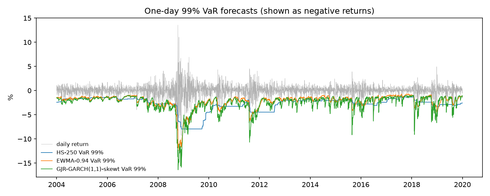

# Rolling VaR and ES forecasts: development period

4,027 one-day-ahead forecasts, 2004-01-02 to 2019-12-31. GARCH-family models are re-estimated every 5 days on a rolling 1000-day window. The locked test period is not used.

VaR and ES are positive losses in percent. An exception is a day whose loss exceeds the VaR forecast. These rates are a first look; formal backtests follow in Step 3.2.

| model | mean VaR 99.0% | exceptions 99.0% | rate 99.0% (target 1.0%) | mean VaR 97.5% | exceptions 97.5% | rate 97.5% (target 2.5%) | mean ES 97.5% |
|---|---|---|---|---|---|---|---|
| HS-250 | 2.7857 | 61 | 1.51% | 2.1240 | 136 | 3.38% | 2.7784 |
| EWMA-0.94 | 2.2038 | 90 | 2.23% | 1.8568 | 156 | 3.87% | 2.2147 |
| GARCH(1,1)-normal | 2.1656 | 100 | 2.48% | 1.8142 | 157 | 3.90% | 2.1766 |
| GARCH(1,1)-t | 2.4068 | 67 | 1.66% | 1.8665 | 151 | 3.75% | 2.4934 |
| GARCH(1,1)-skewt | 2.5542 | 52 | 1.29% | 1.9762 | 135 | 3.35% | 2.6412 |
| GJR-GARCH(1,1)-normal | 2.1851 | 89 | 2.21% | 1.8363 | 153 | 3.80% | 2.1960 |
| FHS-GJR | 2.4892 | 50 | 1.24% | 2.0732 | 109 | 2.71% | 2.6102 |
| GJR-GARCH(1,1)-t | 2.3964 | 61 | 1.51% | 1.8830 | 149 | 3.70% | 2.4700 |
| GJR-GARCH(1,1)-skewt | 2.6074 | 41 | 1.02% | 2.0379 | 116 | 2.88% | 2.6843 |

## Re-estimation

| model | refits | failed |
|---|---|---|
| GARCH(1,1)-normal | 806 | 0 |
| GARCH(1,1)-t | 806 | 0 |
| GARCH(1,1)-skewt | 806 | 0 |
| GJR-GARCH(1,1)-normal | 806 | 0 |
| GJR-GARCH(1,1)-t | 806 | 0 |
| GJR-GARCH(1,1)-skewt | 806 | 0 |

A failed refit keeps the previous parameters.

