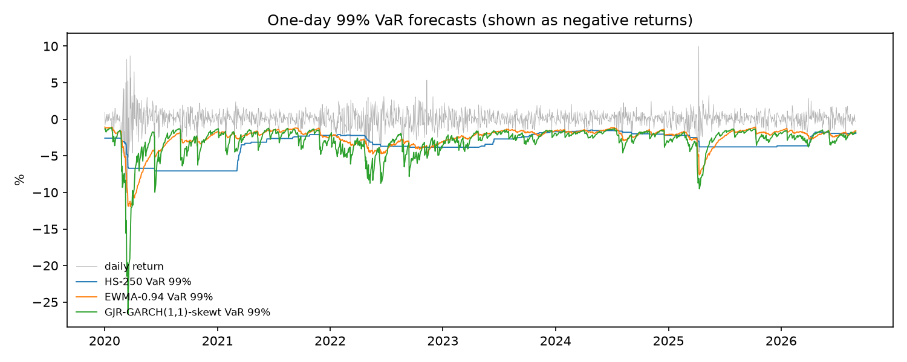

# Rolling VaR and ES forecasts: locked test period

1,674 one-day-ahead forecasts, 2020-01-02 to 2026-08-31. GARCH-family models are re-estimated every 5 days on a rolling 1000-day window. This is the one-time evaluation on the locked test period, with every setting fixed during development.

VaR and ES are positive losses in percent. An exception is a day whose loss exceeds the VaR forecast. These rates are a first look; formal backtests follow in Step 3.2.

| model | mean VaR 99.0% | exceptions 99.0% | rate 99.0% (target 1.0%) | mean VaR 97.5% | exceptions 97.5% | rate 97.5% (target 2.5%) | mean ES 97.5% |
|---|---|---|---|---|---|---|---|
| HS-250 | 3.3850 | 30 | 1.79% | 2.4976 | 57 | 3.41% | 3.4383 |
| EWMA-0.94 | 2.5385 | 40 | 2.39% | 2.1387 | 71 | 4.24% | 2.5510 |
| GARCH(1,1)-normal | 2.4370 | 40 | 2.39% | 2.0380 | 68 | 4.06% | 2.4495 |
| GARCH(1,1)-t | 2.7150 | 29 | 1.73% | 2.0845 | 60 | 3.58% | 2.8232 |
| GARCH(1,1)-skewt | 2.9236 | 25 | 1.49% | 2.2492 | 51 | 3.05% | 3.0249 |
| GJR-GARCH(1,1)-normal | 2.4570 | 35 | 2.09% | 2.0601 | 61 | 3.64% | 2.4694 |
| FHS-GJR | 3.0344 | 20 | 1.19% | 2.3252 | 41 | 2.45% | 3.2368 |
| GJR-GARCH(1,1)-t | 2.7083 | 28 | 1.67% | 2.0942 | 56 | 3.35% | 2.8090 |
| GJR-GARCH(1,1)-skewt | 2.9811 | 20 | 1.19% | 2.3013 | 42 | 2.51% | 3.0797 |

## Re-estimation

| model | refits | failed |
|---|---|---|
| GARCH(1,1)-normal | 335 | 0 |
| GARCH(1,1)-t | 335 | 0 |
| GARCH(1,1)-skewt | 335 | 0 |
| GJR-GARCH(1,1)-normal | 335 | 0 |
| GJR-GARCH(1,1)-t | 335 | 0 |
| GJR-GARCH(1,1)-skewt | 335 | 0 |

A failed refit keeps the previous parameters.

