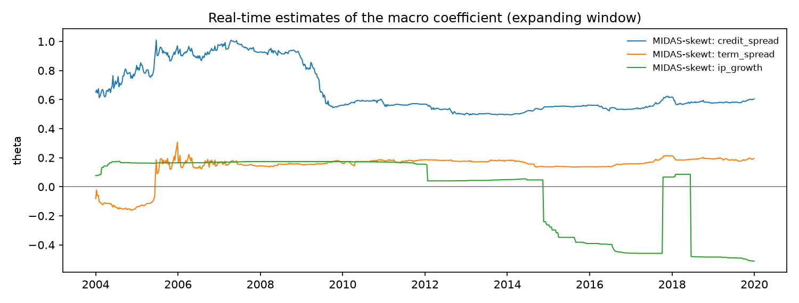

# Macro-augmented forecasts: development period

4,027 one-day-ahead forecasts, 2004-01-02 to 2019-12-31. All models use an expanding window from 2000 and are re-estimated every 5 days. The locked test period is not used.

| model | exceptions 99.0% | rate 99.0% (target 1.0%) | exceptions 97.5% | rate 97.5% (target 2.5%) | mean ES 97.5% | refits | failed refits |
|---|---|---|---|---|---|---|---|
| GJR-GARCH(1,1)-skewt (expanding) | 44 | 1.09% | 111 | 2.76% | 2.6236 | 806 | 0 |
| MIDAS-skewt: credit_spread | 45 | 1.12% | 110 | 2.73% | 2.6561 | 806 | 0 |
| MIDAS-skewt: term_spread | 46 | 1.14% | 114 | 2.83% | 2.6105 | 806 | 0 |
| MIDAS-skewt: ip_growth | 41 | 1.02% | 105 | 2.61% | 2.6645 | 806 | 170 |

## Real-time estimates of theta

The macro coefficient as estimated at each refit, using only data up to that date.

| model | first | median | last | share positive |
|---|---|---|---|---|
| MIDAS-skewt: credit_spread | 0.6517 | 0.5790 | 0.6049 | 100% |
| MIDAS-skewt: term_spread | -0.0820 | 0.1664 | 0.1946 | 91% |
| MIDAS-skewt: ip_growth | 0.0773 | 0.0859 | -0.5119 | 72% |

Formal evaluation: backtests_macro_development.md and model_comparison_macro_development.md.

