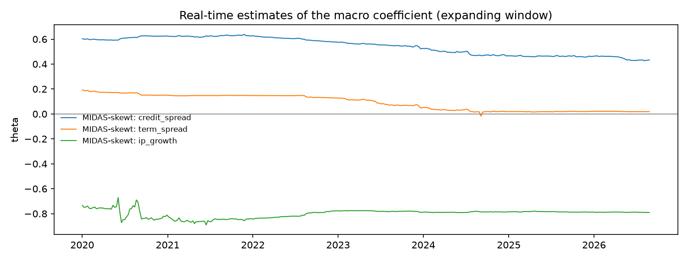

# Macro-augmented forecasts: locked test period

1,674 one-day-ahead forecasts, 2020-01-02 to 2026-08-31. All models use an expanding window from 2000 and are re-estimated every 5 days. This is the one-time evaluation on the locked test period, with every setting fixed during development.

| model | exceptions 99.0% | rate 99.0% (target 1.0%) | exceptions 97.5% | rate 97.5% (target 2.5%) | mean ES 97.5% | refits | failed refits |
|---|---|---|---|---|---|---|---|
| GJR-GARCH(1,1)-skewt (expanding) | 22 | 1.31% | 45 | 2.69% | 3.0230 | 335 | 0 |
| MIDAS-skewt: credit_spread | 25 | 1.49% | 52 | 3.11% | 2.8980 | 335 | 0 |
| MIDAS-skewt: term_spread | 24 | 1.43% | 47 | 2.81% | 2.9916 | 335 | 0 |
| MIDAS-skewt: ip_growth | 24 | 1.43% | 45 | 2.69% | 3.0283 | 335 | 0 |

## Real-time estimates of theta

The macro coefficient as estimated at each refit, using only data up to that date.

| model | first | median | last | share positive |
|---|---|---|---|---|
| MIDAS-skewt: credit_spread | 0.6040 | 0.5617 | 0.4332 | 100% |
| MIDAS-skewt: term_spread | 0.1931 | 0.1112 | 0.0190 | 100% |
| MIDAS-skewt: ip_growth | -0.7336 | -0.7880 | -0.7905 | 0% |

Formal evaluation: backtests_macro_locked_test.md and model_comparison_macro_locked_test.md.

