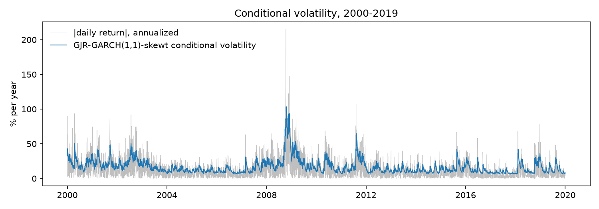

# GARCH-family models: in-sample estimates

Sample: 2000-01-04 to 2019-12-31 (5,030 daily returns, in percent). The locked test period is excluded.
All models have a constant mean. Estimated from scratch by maximum likelihood (`src/var_es/models/garch.py`).

## Parameter estimates (robust standard errors)

| parameter | GARCH(1,1)-normal | GARCH(1,1)-t | GARCH(1,1)-skewt | GJR-GARCH(1,1)-normal | GJR-GARCH(1,1)-t | GJR-GARCH(1,1)-skewt |
|---|---|---|---|---|---|---|
| mu | 0.0671 (0.0111) | 0.0812 (0.0099) | 0.0614 (0.0107) | 0.0284 (0.0108) | 0.0527 (0.0099) | 0.0272 (0.0105) |
| omega | 0.0216 (0.0050) | 0.0122 (0.0032) | 0.0122 (0.0030) | 0.0227 (0.0040) | 0.0165 (0.0032) | 0.0182 (0.0033) |
| alpha | 0.1182 (0.0137) | 0.1205 (0.0135) | 0.1177 (0.0127) | 0 (at bound) | 1.0e-17 (at bound) | 7.8e-18 (at bound) |
| gamma | - | - | - | 0.2000 (0.0218) | 0.2123 (0.0247) | 0.2203 (0.0251) |
| beta | 0.8649 (0.0139) | 0.8776 (0.0127) | 0.8776 (0.0123) | 0.8772 (0.0116) | 0.8790 (0.0124) | 0.8763 (0.0122) |
| nu | - | 6.0688 (0.5422) | 6.6162 (0.6304) | - | 6.8086 (0.6777) | 7.4298 (0.7889) |
| lambda | - | - | -0.1122 (0.0169) | - | - | -0.1505 (0.0177) |

"at bound": the estimate sits on a constraint (e.g. alpha = 0), where the usual standard error is not defined.

## Model comparison

|  | GARCH(1,1)-normal | GARCH(1,1)-t | GARCH(1,1)-skewt | GJR-GARCH(1,1)-normal | GJR-GARCH(1,1)-t | GJR-GARCH(1,1)-skewt |
|---|---|---|---|---|---|---|
| log-likelihood | -6,815.3 | -6,694.6 | -6,676.6 | -6,703.8 | -6,606.9 | -6,575.7 |
| AIC | 13,638.6 | 13,399.3 | 13,365.3 | 13,417.7 | 13,225.7 | 13,165.4 |
| BIC | 13,664.7 | 13,431.9 | 13,404.4 | 13,450.3 | 13,264.9 | 13,211.1 |
| persistence | 0.9831 | 0.9981 | 0.9953 | 0.9773 | 0.9852 | 0.9865 |
| half-life (days) | 40.6 | 365.0 | 147.1 | 30.1 | 46.4 | 50.9 |
| unconditional vol (%, annualized) | 17.9 | 40.2 | 25.5 | 15.9 | 16.7 | 18.4 |

Lowest AIC: **GJR-GARCH(1,1)-skewt**. Lowest BIC: **GJR-GARCH(1,1)-skewt**.

## Likelihood-ratio tests

Each row tests one restriction of a larger model against the data: no leverage (gamma = 0) or no skewness (lambda = 0). The statistic 2 x (log-likelihood gain) is compared with a chi-squared distribution with 1 degree of freedom.

| restriction tested | restricted model | full model | LR statistic | p-value |
|---|---|---|---|---|
| gamma = 0, normal shocks | GARCH(1,1)-normal | GJR-GARCH(1,1)-normal | 223.0 | 2.0e-50 |
| gamma = 0, t shocks | GARCH(1,1)-t | GJR-GARCH(1,1)-t | 175.6 | 4.5e-40 |
| gamma = 0, skewt shocks | GARCH(1,1)-skewt | GJR-GARCH(1,1)-skewt | 201.9 | 8.1e-46 |
| lambda = 0, GARCH | GARCH(1,1)-t | GARCH(1,1)-skewt | 36.0 | 2.0e-09 |
| lambda = 0, GJR-GARCH | GJR-GARCH(1,1)-t | GJR-GARCH(1,1)-skewt | 62.3 | 2.9e-15 |

## Standardized residual diagnostics

If a model captures the volatility dynamics, its standardized residuals should show no remaining ARCH effects (high p-values). Remaining excess kurtosis indicates fat tails that normal shocks cannot capture.

|  | raw returns | GARCH(1,1)-normal | GARCH(1,1)-t | GARCH(1,1)-skewt | GJR-GARCH(1,1)-normal | GJR-GARCH(1,1)-t | GJR-GARCH(1,1)-skewt |
|---|---|---|---|---|---|---|---|
| skewness | -0.0731 | -0.5272 | -0.5886 | -0.5867 | -0.5334 | -0.5680 | -0.5653 |
| excess kurtosis | 10.6 | 1.9249 | 2.3944 | 2.3962 | 1.7538 | 2.0382 | 2.0163 |
| Ljung-Box p, z (10 lags) | 2.2e-07 | 0.0304 | 0.0253 | 0.0303 | 0.0606 | 0.0297 | 0.0656 |
| Ljung-Box p, z squared (10 lags) | 0 | 0.1194 | 0.3086 | 0.3198 | 0.1242 | 0.1183 | 0.0905 |
| ARCH-LM p (5 lags) | 1.3e-251 | 0.4643 | 0.6553 | 0.6448 | 0.1453 | 0.0946 | 0.0723 |

## Validation against the `arch` package

|  | GARCH(1,1)-normal | GARCH(1,1)-t | GARCH(1,1)-skewt | GJR-GARCH(1,1)-normal | GJR-GARCH(1,1)-t | GJR-GARCH(1,1)-skewt |
|---|---|---|---|---|---|---|
| max abs parameter difference | 8.2e-07 | 0.0001 | 0.0003 | 1.1e-06 | 0.0001 | 1.2e-05 |
| max relative SE difference | 1.0e-04 | 0.0001 | 0.0001 | 0.1086 | 0.0923 | 0.0967 |
| log-likelihood difference | 1.7e-08 | 2.3e-07 | 2.0e-07 | 1.0e-07 | 6.3e-08 | 2.2e-07 |
| parameters at bound | none | none | none | alpha | alpha | alpha |
| converged | True | True | True | True | True | True |

Parameter estimates and log-likelihoods should agree closely. When a parameter sits on its bound, standard errors differ by design: this implementation holds that parameter fixed, while `arch` treats it as free, which also changes the standard errors of parameters correlated with it.

## Figure

