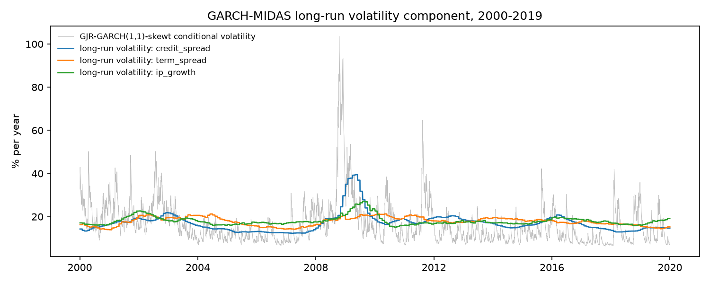

# GJR-GARCH-MIDAS: in-sample estimates

Sample: 2000-01-04 to 2019-12-31 (5,030 daily returns). Each model uses one macro variable in the long-run component, with 12 monthly lags known in real time at the start of each month. Skewed-t shocks throughout. Baseline: GJR-GARCH(1,1)-skewt on the same sample. The locked test period is excluded.

## Parameter estimates (robust standard errors)

| parameter | credit_spread | term_spread | ip_growth |
|---|---|---|---|
| mu | 0.0288 (0.0105) | 0.0277 (0.0105) | 0.0276 (0.0106) |
| alpha | 0 (at bound) | 2.5e-18 (at bound) | 2.8e-20 (at bound) |
| gamma | 0.2290 (0.0239) | 0.2189 (0.0250) | 0.2230 (0.0247) |
| beta | 0.8612 (0.0129) | 0.8747 (0.0123) | 0.8724 (0.0123) |
| m0 | -1.4832 (0.3819) | -0.1266 (0.3232) | 0.3392 (0.2872) |
| theta | 0.6040 (0.1124) | 0.1931 (0.0657) | -0.7339 (0.3295) |
| w | 4.8234 (2.1370) | 50.0 (at bound) | 1.0000 (at bound) |
| nu | 7.8303 (0.8961) | 7.5153 (0.8257) | 7.4628 (0.7925) |
| lambda | -0.1522 (0.0176) | -0.1497 (0.0177) | -0.1509 (0.0177) |

theta: change in ln(long-run variance) per unit of the weighted macro variable. w: lag-weight shape (1 = equal weights; larger = more weight on recent months).

## Comparison with the baseline

|  | GJR-GARCH(1,1)-skewt | MIDAS: credit_spread | MIDAS: term_spread | MIDAS: ip_growth |
|---|---|---|---|---|
| log-likelihood | -6,575.7 | -6,564.4 | -6,570.7 | -6,573.3 |
| LR vs baseline | n/a | 22.7 | 10.1 | 4.8743 |
| AIC | 13,165.4 | 13,146.7 | 13,159.3 | 13,164.5 |
| BIC | 13,211.1 | 13,205.4 | 13,218.0 | 13,223.2 |
| persistence | 0.9865 | 0.9757 | 0.9841 | 0.9839 |
| theta t-stat | n/a | 5.3758 | 2.9402 | -2.2276 |
| variance ratio | n/a | 0.1944 | 0.0537 | 0.0478 |
| long-run vol, +1 sd of macro | - | +24.0% | +11.9% | -10.0% |

LR vs baseline = 2 x log-likelihood gain. Because w has no effect when theta = 0, this does not follow the usual chi-squared distribution (Davies, 1987); treat it as descriptive. Variance ratio: share of the variation in ln(variance) explained by the long-run component. With three variables tested, one nominally significant result could arise by chance.

## Standardized residual diagnostics

|  | GJR-GARCH(1,1)-skewt | MIDAS: credit_spread | MIDAS: term_spread | MIDAS: ip_growth |
|---|---|---|---|---|
| skewness | -0.5653 | -0.5892 | -0.5945 | -0.5612 |
| excess kurtosis | 2.0163 | 2.2363 | 2.3501 | 1.9900 |
| Ljung-Box p, z squared (10 lags) | 0.0905 | 0.0428 | 0.1180 | 0.0648 |
| ARCH-LM p (5 lags) | 0.0723 | 0.0297 | 0.1176 | 0.0426 |

In-sample fit is not the research question: whether macro information improves out-of-sample VaR and ES forecasts is tested in Step 5.3.

