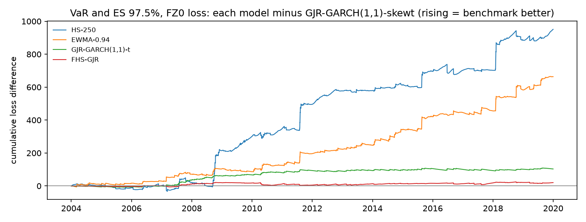

# Model comparison: development period

4,027 one-day-ahead forecasts per model (2004-2019). Lower loss is better. Diebold-Mariano (DM) tests compare each model with the benchmark, **GJR-GARCH(1,1)-skewt**, using Newey-West standard errors; a positive DM t means the model has higher loss than the benchmark. The Model Confidence Set (MCS, 90%) uses a stationary bootstrap with mean block length 10 and 10,000 replications. The locked test period is not used.

## Summary

Rank by average loss; * marks models in the 90% MCS.

| model | VaR 99.0%, tick loss | VaR 97.5%, tick loss | VaR and ES 97.5%, FZ0 loss | variance, QLIKE vs gk_overnight | variance, QLIKE vs sq_ret | variance, QLIKE vs parkinson | variance, MSE vs gk_overnight |
|---|---|---|---|---|---|---|---|
| GJR-GARCH(1,1)-skewt | 1 * | 1 * | 1 * | 3 * | 2 * | 2 * | 1 * |
| FHS-GJR | 2 * | 2 * | 2 * | - | - | - | - |
| GJR-GARCH(1,1)-t | 3 * | 3 * | 3 | 2 * | 1 * | 3 | 2 * |
| GARCH(1,1)-skewt | 4 * | 5 * | 4 | 5 | 5 | 4 | 5 |
| GJR-GARCH(1,1)-normal | 6 * | 4 * | 5 | 1 * | 3 * | 1 * | 3 * |
| GARCH(1,1)-t | 5 * | 6 | 6 | 4 | 4 | 6 | 4 |
| GARCH(1,1)-normal | 7 | 7 | 7 | 6 | 6 | 5 | 6 * |
| EWMA-0.94 | 8 | 8 | 8 | 7 | 7 | 7 | 7 |
| HS-250 | 9 | 9 | 9 | - | - | - | - |

## VaR 99.0%, tick loss

| model | mean loss | rank | vs benchmark | DM t | DM p | MCS p | in MCS |
|---|---|---|---|---|---|---|---|
| GJR-GARCH(1,1)-skewt | 0.0318 | 1 | +0.00% | n/a | n/a | 1.0000 | yes |
| FHS-GJR | 0.0318 | 2 | +0.08% | 0.0661 | 0.9473 | 0.9500 | yes |
| GJR-GARCH(1,1)-t | 0.0319 | 3 | +0.30% | 0.2608 | 0.7943 | 0.9217 | yes |
| GARCH(1,1)-skewt | 0.0329 | 4 | +3.51% | 1.4970 | 0.1344 | 0.2119 | yes |
| GARCH(1,1)-t | 0.0332 | 5 | +4.49% | 1.6074 | 0.1080 | 0.1354 | yes |
| GJR-GARCH(1,1)-normal | 0.0336 | 6 | +5.48% | 2.0170 | 0.0437 | 0.1017 | yes |
| GARCH(1,1)-normal | 0.0353 | 7 | +11.05% | 2.4858 | 0.0129 | 0.0174 | no |
| EWMA-0.94 | 0.0366 | 8 | +14.88% | 2.6327 | 0.0085 | 0.0174 | no |
| HS-250 | 0.0421 | 9 | +32.45% | 3.1406 | 0.0017 | 0.0157 | no |

## VaR 97.5%, tick loss

| model | mean loss | rank | vs benchmark | DM t | DM p | MCS p | in MCS |
|---|---|---|---|---|---|---|---|
| GJR-GARCH(1,1)-skewt | 0.0665 | 1 | +0.00% | n/a | n/a | 1.0000 | yes |
| FHS-GJR | 0.0669 | 2 | +0.60% | 1.2504 | 0.2111 | 0.2130 | yes |
| GJR-GARCH(1,1)-t | 0.0674 | 3 | +1.47% | 2.1261 | 0.0335 | 0.2130 | yes |
| GJR-GARCH(1,1)-normal | 0.0682 | 4 | +2.65% | 2.4355 | 0.0149 | 0.2130 | yes |
| GARCH(1,1)-skewt | 0.0685 | 5 | +3.03% | 2.1831 | 0.0290 | 0.2130 | yes |
| GARCH(1,1)-t | 0.0693 | 6 | +4.24% | 2.5359 | 0.0112 | 0.0647 | no |
| GARCH(1,1)-normal | 0.0704 | 7 | +5.88% | 2.9692 | 0.0030 | 0.0194 | no |
| EWMA-0.94 | 0.0709 | 8 | +6.63% | 2.7067 | 0.0068 | 0.0448 | no |
| HS-250 | 0.0819 | 9 | +23.29% | 3.8543 | 0.0001 | 0.0046 | no |

## VaR and ES 97.5%, FZ0 loss

| model | mean loss | rank | vs benchmark | DM t | DM p | MCS p | in MCS |
|---|---|---|---|---|---|---|---|
| GJR-GARCH(1,1)-skewt | 0.8796 | 1 | +0.00% | n/a | n/a | 1.0000 | yes |
| FHS-GJR | 0.8846 | 2 | +0.57% | 0.7993 | 0.4241 | 0.4292 | yes |
| GJR-GARCH(1,1)-t | 0.9052 | 3 | +2.91% | 2.7491 | 0.0060 | 0.0555 | no |
| GARCH(1,1)-skewt | 0.9265 | 4 | +5.34% | 2.6641 | 0.0077 | 0.0555 | no |
| GJR-GARCH(1,1)-normal | 0.9366 | 5 | +6.48% | 3.7376 | 0.0002 | 0.0184 | no |
| GARCH(1,1)-t | 0.9479 | 6 | +7.77% | 3.2563 | 0.0011 | 0.0184 | no |
| GARCH(1,1)-normal | 0.9894 | 7 | +12.49% | 3.8783 | 0.0001 | 0.0127 | no |
| EWMA-0.94 | 1.0444 | 8 | +18.74% | 3.8643 | 0.0001 | 0.0127 | no |
| HS-250 | 1.1158 | 9 | +26.85% | 3.4934 | 0.0005 | 0.0127 | no |

## variance, QLIKE vs gk_overnight

| model | mean loss | rank | vs benchmark | DM t | DM p | MCS p | in MCS |
|---|---|---|---|---|---|---|---|
| GJR-GARCH(1,1)-normal | 0.6706 | 1 | -0.42% | -1.1174 | 0.2638 | 1.0000 | yes |
| GJR-GARCH(1,1)-t | 0.6725 | 2 | -0.13% | -1.4083 | 0.1590 | 0.4174 | yes |
| GJR-GARCH(1,1)-skewt | 0.6734 | 3 | +0.00% | n/a | n/a | 0.2890 | yes |
| GARCH(1,1)-t | 0.6921 | 4 | +2.77% | 1.6414 | 0.1007 | 0.0809 | no |
| GARCH(1,1)-skewt | 0.6932 | 5 | +2.94% | 1.7375 | 0.0823 | 0.0569 | no |
| GARCH(1,1)-normal | 0.6976 | 6 | +3.60% | 1.9698 | 0.0489 | 0.0347 | no |
| EWMA-0.94 | 0.7349 | 7 | +9.14% | 3.8208 | 0.0001 | 0.0005 | no |

## variance, QLIKE vs sq_ret

| model | mean loss | rank | vs benchmark | DM t | DM p | MCS p | in MCS |
|---|---|---|---|---|---|---|---|
| GJR-GARCH(1,1)-t | 0.6504 | 1 | -0.10% | -0.8338 | 0.4044 | 1.0000 | yes |
| GJR-GARCH(1,1)-skewt | 0.6510 | 2 | +0.00% | n/a | n/a | 0.4114 | yes |
| GJR-GARCH(1,1)-normal | 0.6540 | 3 | +0.46% | 1.0576 | 0.2902 | 0.2810 | yes |
| GARCH(1,1)-t | 0.6911 | 4 | +6.16% | 4.0856 | 4.4e-05 | 0.0002 | no |
| GARCH(1,1)-skewt | 0.6934 | 5 | +6.50% | 4.2854 | 1.8e-05 | 0.0001 | no |
| GARCH(1,1)-normal | 0.6965 | 6 | +6.99% | 4.4069 | 1.0e-05 | 0.0001 | no |
| EWMA-0.94 | 0.7506 | 7 | +15.29% | 5.3270 | 1.0e-07 | 0 | no |

Note: Squared returns are unbiased but very noisy, so differences are harder to detect.

## variance, QLIKE vs parkinson

| model | mean loss | rank | vs benchmark | DM t | DM p | MCS p | in MCS |
|---|---|---|---|---|---|---|---|
| GJR-GARCH(1,1)-normal | 0.3606 | 1 | -0.70% | -1.2324 | 0.2178 | 1.0000 | yes |
| GJR-GARCH(1,1)-skewt | 0.3632 | 2 | +0.00% | n/a | n/a | 0.2592 | yes |
| GJR-GARCH(1,1)-t | 0.3651 | 3 | +0.53% | 3.8085 | 0.0001 | 0.0028 | no |
| GARCH(1,1)-skewt | 0.3937 | 4 | +8.39% | 4.7084 | 2.5e-06 | 0 | no |
| GARCH(1,1)-normal | 0.3949 | 5 | +8.74% | 4.6110 | 4.0e-06 | 0.0001 | no |
| GARCH(1,1)-t | 0.3978 | 6 | +9.54% | 5.4049 | 6.5e-08 | 0 | no |
| EWMA-0.94 | 0.4025 | 7 | +10.84% | 3.3873 | 0.0007 | 0.0028 | no |

Note: Parkinson misses the overnight move (it captures about two-thirds of close-to-close variance), so it is biased low and QLIKE on it favours models that under-forecast. Kept because it was pre-registered; interpret with caution.

## variance, MSE vs gk_overnight

| model | mean loss | rank | vs benchmark | DM t | DM p | MCS p | in MCS |
|---|---|---|---|---|---|---|---|
| GJR-GARCH(1,1)-skewt | 9.0709 | 1 | +0.00% | n/a | n/a | 1.0000 | yes |
| GJR-GARCH(1,1)-t | 9.1047 | 2 | +0.37% | 1.2315 | 0.2181 | 0.7649 | yes |
| GJR-GARCH(1,1)-normal | 9.1719 | 3 | +1.11% | 0.4062 | 0.6846 | 0.7649 | yes |
| GARCH(1,1)-t | 10.4 | 4 | +14.88% | 1.9167 | 0.0553 | 0.0820 | no |
| GARCH(1,1)-skewt | 10.5 | 5 | +15.45% | 1.9103 | 0.0561 | 0.0820 | no |
| GARCH(1,1)-normal | 10.5 | 6 | +16.30% | 1.6915 | 0.0907 | 0.1079 | yes |
| EWMA-0.94 | 11.0 | 7 | +20.74% | 1.9381 | 0.0526 | 0.0820 | no |

Note: MSE is dominated by a few crisis days, so it is less informative than QLIKE.

The MCS implementation reproduces the `arch` package's MCS(method="max") exactly when given the same bootstrap draws (see tests/test_evaluation.py).

