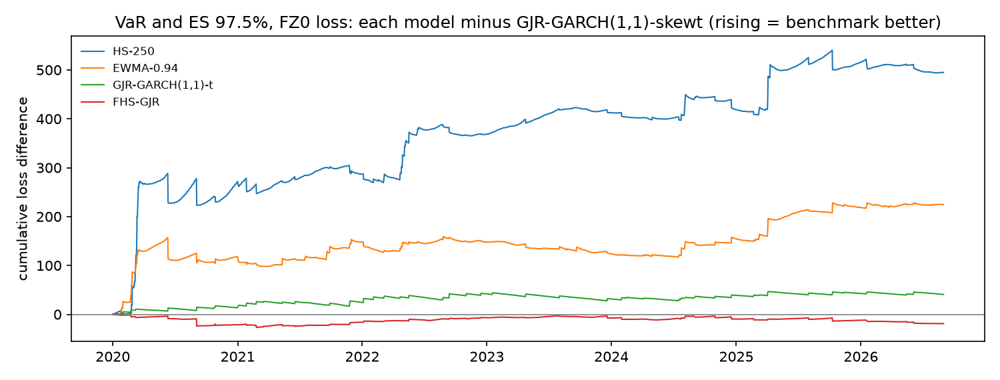

# Model comparison: locked test period

1,674 one-day-ahead forecasts per model (2020-01-02 to 2026-08-31). Lower loss is better. Diebold-Mariano (DM) tests compare each model with the benchmark, **GJR-GARCH(1,1)-skewt**, using Newey-West standard errors; a positive DM t means the model has higher loss than the benchmark. The Model Confidence Set (MCS, 90%) uses a stationary bootstrap with mean block length 10 and 10,000 replications. This is the one-time evaluation on the locked test period, with every setting fixed during development.

## Summary

Rank by average loss; * marks models in the 90% MCS.

| model | VaR 99.0%, tick loss | VaR 97.5%, tick loss | VaR and ES 97.5%, FZ0 loss | variance, QLIKE vs gk_overnight | variance, QLIKE vs sq_ret | variance, QLIKE vs parkinson | variance, MSE vs gk_overnight |
|---|---|---|---|---|---|---|---|
| FHS-GJR | 4 * | 3 * | 1 * | - | - | - | - |
| GJR-GARCH(1,1)-skewt | 1 * | 2 * | 2 * | 2 * | 2 * | 1 * | 5 * |
| GARCH(1,1)-skewt | 3 * | 5 * | 3 * | 5 | 5 * | 4 | 4 * |
| GJR-GARCH(1,1)-t | 2 * | 1 * | 4 * | 1 * | 1 * | 3 * | 6 * |
| GARCH(1,1)-t | 5 * | 6 * | 5 * | 4 | 4 * | 6 | 2 * |
| GJR-GARCH(1,1)-normal | 6 * | 4 * | 6 * | 3 | 3 * | 2 * | 3 * |
| GARCH(1,1)-normal | 7 * | 7 * | 7 * | 6 | 6 * | 5 | 1 * |
| EWMA-0.94 | 8 * | 8 * | 8 * | 7 | 7 | 7 | 7 * |
| HS-250 | 9 * | 9 | 9 * | - | - | - | - |

## VaR 99.0%, tick loss

| model | mean loss | rank | vs benchmark | DM t | DM p | MCS p | in MCS |
|---|---|---|---|---|---|---|---|
| GJR-GARCH(1,1)-skewt | 0.0408 | 1 | +0.00% | n/a | n/a | 1.0000 | yes |
| GJR-GARCH(1,1)-t | 0.0410 | 2 | +0.52% | 0.3267 | 0.7439 | 0.9447 | yes |
| GARCH(1,1)-skewt | 0.0412 | 3 | +0.96% | 0.3116 | 0.7553 | 0.9447 | yes |
| FHS-GJR | 0.0414 | 4 | +1.47% | 1.0148 | 0.3102 | 0.8774 | yes |
| GARCH(1,1)-t | 0.0415 | 5 | +1.70% | 0.4742 | 0.6354 | 0.8774 | yes |
| GJR-GARCH(1,1)-normal | 0.0422 | 6 | +3.37% | 0.9341 | 0.3503 | 0.6889 | yes |
| GARCH(1,1)-normal | 0.0433 | 7 | +6.19% | 1.1469 | 0.2514 | 0.4359 | yes |
| EWMA-0.94 | 0.0472 | 8 | +15.74% | 1.5458 | 0.1222 | 0.4050 | yes |
| HS-250 | 0.0592 | 9 | +45.25% | 1.7995 | 0.0719 | 0.1630 | yes |

## VaR 97.5%, tick loss

| model | mean loss | rank | vs benchmark | DM t | DM p | MCS p | in MCS |
|---|---|---|---|---|---|---|---|
| GJR-GARCH(1,1)-t | 0.0786 | 1 | -0.22% | -0.2209 | 0.8251 | 1.0000 | yes |
| GJR-GARCH(1,1)-skewt | 0.0788 | 2 | +0.00% | n/a | n/a | 0.8569 | yes |
| FHS-GJR | 0.0791 | 3 | +0.36% | 0.6084 | 0.5429 | 0.8569 | yes |
| GJR-GARCH(1,1)-normal | 0.0792 | 4 | +0.51% | 0.3684 | 0.7125 | 0.8569 | yes |
| GARCH(1,1)-skewt | 0.0805 | 5 | +2.18% | 1.2948 | 0.1954 | 0.4387 | yes |
| GARCH(1,1)-t | 0.0807 | 6 | +2.40% | 1.1571 | 0.2472 | 0.4387 | yes |
| GARCH(1,1)-normal | 0.0811 | 7 | +2.90% | 1.1890 | 0.2345 | 0.4321 | yes |
| EWMA-0.94 | 0.0877 | 8 | +11.37% | 1.9119 | 0.0559 | 0.2187 | yes |
| HS-250 | 0.1039 | 9 | +31.92% | 2.1176 | 0.0342 | 0.0779 | no |

## VaR and ES 97.5%, FZ0 loss

| model | mean loss | rank | vs benchmark | DM t | DM p | MCS p | in MCS |
|---|---|---|---|---|---|---|---|
| FHS-GJR | 1.0989 | 1 | -1.02% | -0.8743 | 0.3820 | 1.0000 | yes |
| GJR-GARCH(1,1)-skewt | 1.1103 | 2 | +0.00% | n/a | n/a | 0.5370 | yes |
| GARCH(1,1)-skewt | 1.1310 | 3 | +1.87% | 0.7122 | 0.4763 | 0.5370 | yes |
| GJR-GARCH(1,1)-t | 1.1346 | 4 | +2.19% | 1.3710 | 0.1704 | 0.5370 | yes |
| GARCH(1,1)-t | 1.1546 | 5 | +3.99% | 1.3145 | 0.1887 | 0.2713 | yes |
| GJR-GARCH(1,1)-normal | 1.1802 | 6 | +6.30% | 2.1805 | 0.0292 | 0.2199 | yes |
| GARCH(1,1)-normal | 1.1985 | 7 | +7.95% | 2.0771 | 0.0378 | 0.2199 | yes |
| EWMA-0.94 | 1.2444 | 8 | +12.08% | 2.1290 | 0.0333 | 0.2199 | yes |
| HS-250 | 1.4059 | 9 | +26.63% | 2.0844 | 0.0371 | 0.2199 | yes |

## variance, QLIKE vs gk_overnight

| model | mean loss | rank | vs benchmark | DM t | DM p | MCS p | in MCS |
|---|---|---|---|---|---|---|---|
| GJR-GARCH(1,1)-t | 0.9744 | 1 | -0.08% | -0.6768 | 0.4985 | 1.0000 | yes |
| GJR-GARCH(1,1)-skewt | 0.9751 | 2 | +0.00% | n/a | n/a | 0.5040 | yes |
| GJR-GARCH(1,1)-normal | 0.9826 | 3 | +0.76% | 1.7137 | 0.0866 | 0.0879 | no |
| GARCH(1,1)-t | 1.0009 | 4 | +2.64% | 2.2565 | 0.0240 | 0.0750 | no |
| GARCH(1,1)-skewt | 1.0046 | 5 | +3.02% | 2.4398 | 0.0147 | 0.0410 | no |
| GARCH(1,1)-normal | 1.0072 | 6 | +3.28% | 2.6588 | 0.0078 | 0.0148 | no |
| EWMA-0.94 | 1.0666 | 7 | +9.38% | 3.9714 | 7.1e-05 | 0.0013 | no |

## variance, QLIKE vs sq_ret

| model | mean loss | rank | vs benchmark | DM t | DM p | MCS p | in MCS |
|---|---|---|---|---|---|---|---|
| GJR-GARCH(1,1)-t | 0.9944 | 1 | -0.14% | -0.8009 | 0.4232 | 1.0000 | yes |
| GJR-GARCH(1,1)-skewt | 0.9958 | 2 | +0.00% | n/a | n/a | 0.5817 | yes |
| GJR-GARCH(1,1)-normal | 1.0014 | 3 | +0.56% | 0.7592 | 0.4478 | 0.5817 | yes |
| GARCH(1,1)-t | 1.0151 | 4 | +1.93% | 0.8059 | 0.4203 | 0.5817 | yes |
| GARCH(1,1)-skewt | 1.0199 | 5 | +2.42% | 1.0045 | 0.3152 | 0.3803 | yes |
| GARCH(1,1)-normal | 1.0206 | 6 | +2.48% | 1.0296 | 0.3032 | 0.3749 | yes |
| EWMA-0.94 | 1.0705 | 7 | +7.50% | 2.0094 | 0.0445 | 0.0563 | no |

Note: Squared returns are unbiased but very noisy, so differences are harder to detect.

## variance, QLIKE vs parkinson

| model | mean loss | rank | vs benchmark | DM t | DM p | MCS p | in MCS |
|---|---|---|---|---|---|---|---|
| GJR-GARCH(1,1)-skewt | 0.5807 | 1 | +0.00% | n/a | n/a | 1.0000 | yes |
| GJR-GARCH(1,1)-normal | 0.5854 | 2 | +0.81% | 1.2055 | 0.2280 | 0.2874 | yes |
| GJR-GARCH(1,1)-t | 0.5854 | 3 | +0.81% | 5.5782 | 2.4e-08 | 0.2874 | yes |
| GARCH(1,1)-skewt | 0.6129 | 4 | +5.55% | 3.1495 | 0.0016 | 0.0120 | no |
| GARCH(1,1)-normal | 0.6164 | 5 | +6.14% | 3.3528 | 0.0008 | 0.0120 | no |
| GARCH(1,1)-t | 0.6189 | 6 | +6.57% | 3.8236 | 0.0001 | 0.0120 | no |
| EWMA-0.94 | 0.6504 | 7 | +12.00% | 3.6601 | 0.0003 | 0.0120 | no |

Note: Parkinson misses the overnight move (it captures about two-thirds of close-to-close variance), so it is biased low and QLIKE on it favours models that under-forecast. Kept because it was pre-registered; interpret with caution.

## variance, MSE vs gk_overnight

| model | mean loss | rank | vs benchmark | DM t | DM p | MCS p | in MCS |
|---|---|---|---|---|---|---|---|
| GARCH(1,1)-normal | 17.9 | 1 | -6.63% | -0.6141 | 0.5392 | 1.0000 | yes |
| GARCH(1,1)-t | 18.6 | 2 | -3.39% | -0.3820 | 0.7024 | 0.7876 | yes |
| GJR-GARCH(1,1)-normal | 18.6 | 3 | -3.24% | -0.9931 | 0.3207 | 0.7876 | yes |
| GARCH(1,1)-skewt | 18.7 | 4 | -2.85% | -0.3218 | 0.7476 | 0.7876 | yes |
| GJR-GARCH(1,1)-skewt | 19.2 | 5 | +0.00% | n/a | n/a | 0.7876 | yes |
| GJR-GARCH(1,1)-t | 19.3 | 6 | +0.33% | 0.4593 | 0.6460 | 0.7649 | yes |
| EWMA-0.94 | 26.1 | 7 | +35.79% | 1.2163 | 0.2239 | 0.3022 | yes |

Note: MSE is dominated by a few crisis days, so it is less informative than QLIKE.

The MCS implementation reproduces the `arch` package's MCS(method="max") exactly when given the same bootstrap draws (see tests/test_evaluation.py).

