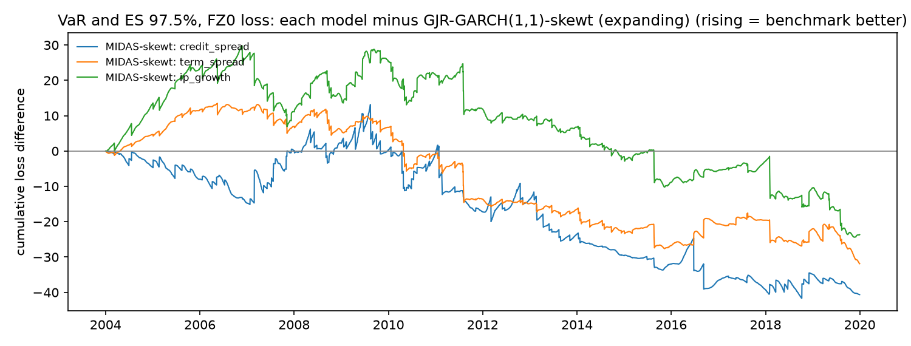

# Model comparison: development period

4,027 one-day-ahead forecasts per model (2004-2019). Lower loss is better. Diebold-Mariano (DM) tests compare each model with the benchmark, **GJR-GARCH(1,1)-skewt (expanding)**, using Newey-West standard errors; a positive DM t means the model has higher loss than the benchmark. The Model Confidence Set (MCS, 90%) uses a stationary bootstrap with mean block length 10 and 10,000 replications. The locked test period is not used.

## Summary

Rank by average loss; * marks models in the 90% MCS.

| model | VaR 99.0%, tick loss | VaR 97.5%, tick loss | VaR and ES 97.5%, FZ0 loss | variance, QLIKE vs gk_overnight | variance, QLIKE vs sq_ret | variance, QLIKE vs parkinson | variance, MSE vs gk_overnight |
|---|---|---|---|---|---|---|---|
| MIDAS-skewt: credit_spread | 4 * | 2 * | 1 * | 1 * | 1 * | 2 * | 4 * |
| MIDAS-skewt: term_spread | 1 * | 1 * | 2 * | 3 | 3 * | 3 | 2 * |
| MIDAS-skewt: ip_growth | 2 * | 3 * | 3 * | 4 | 2 * | 4 | 1 * |
| GJR-GARCH(1,1)-skewt (expanding) | 3 * | 4 * | 4 * | 2 | 4 * | 1 * | 3 * |

## VaR 99.0%, tick loss

| model | mean loss | rank | vs benchmark | DM t | DM p | MCS p | in MCS |
|---|---|---|---|---|---|---|---|
| MIDAS-skewt: term_spread | 0.0322 | 1 | -0.38% | -0.4827 | 0.6293 | 1.0000 | yes |
| MIDAS-skewt: ip_growth | 0.0323 | 2 | -0.23% | -0.1850 | 0.8532 | 0.8941 | yes |
| GJR-GARCH(1,1)-skewt (expanding) | 0.0324 | 3 | +0.00% | n/a | n/a | 0.8941 | yes |
| MIDAS-skewt: credit_spread | 0.0324 | 4 | +0.20% | 0.2670 | 0.7895 | 0.8941 | yes |

## VaR 97.5%, tick loss

| model | mean loss | rank | vs benchmark | DM t | DM p | MCS p | in MCS |
|---|---|---|---|---|---|---|---|
| MIDAS-skewt: term_spread | 0.0668 | 1 | -0.43% | -0.7961 | 0.4260 | 1.0000 | yes |
| MIDAS-skewt: credit_spread | 0.0671 | 2 | -0.06% | -0.1069 | 0.9149 | 0.9332 | yes |
| MIDAS-skewt: ip_growth | 0.0671 | 3 | -0.03% | -0.0434 | 0.9654 | 0.9332 | yes |
| GJR-GARCH(1,1)-skewt (expanding) | 0.0671 | 4 | +0.00% | n/a | n/a | 0.9332 | yes |

## VaR and ES 97.5%, FZ0 loss

| model | mean loss | rank | vs benchmark | DM t | DM p | MCS p | in MCS |
|---|---|---|---|---|---|---|---|
| MIDAS-skewt: credit_spread | 0.8883 | 1 | -1.12% | -1.3055 | 0.1917 | 1.0000 | yes |
| MIDAS-skewt: term_spread | 0.8905 | 2 | -0.88% | -1.5135 | 0.1301 | 0.8254 | yes |
| MIDAS-skewt: ip_growth | 0.8926 | 3 | -0.65% | -0.7724 | 0.4398 | 0.8254 | yes |
| GJR-GARCH(1,1)-skewt (expanding) | 0.8984 | 4 | +0.00% | n/a | n/a | 0.1808 | yes |

## variance, QLIKE vs gk_overnight

| model | mean loss | rank | vs benchmark | DM t | DM p | MCS p | in MCS |
|---|---|---|---|---|---|---|---|
| MIDAS-skewt: credit_spread | 0.6694 | 1 | -1.47% | -2.4912 | 0.0127 | 1.0000 | yes |
| GJR-GARCH(1,1)-skewt (expanding) | 0.6794 | 2 | +0.00% | n/a | n/a | 0.0202 | no |
| MIDAS-skewt: term_spread | 0.6826 | 3 | +0.47% | 1.2009 | 0.2298 | 0.0202 | no |
| MIDAS-skewt: ip_growth | 0.6867 | 4 | +1.07% | 1.9023 | 0.0571 | 0.0196 | no |

## variance, QLIKE vs sq_ret

| model | mean loss | rank | vs benchmark | DM t | DM p | MCS p | in MCS |
|---|---|---|---|---|---|---|---|
| MIDAS-skewt: credit_spread | 0.6555 | 1 | -0.91% | -1.3232 | 0.1858 | 1.0000 | yes |
| MIDAS-skewt: ip_growth | 0.6602 | 2 | -0.21% | -0.3834 | 0.7014 | 0.4740 | yes |
| MIDAS-skewt: term_spread | 0.6605 | 3 | -0.16% | -0.3691 | 0.7120 | 0.4740 | yes |
| GJR-GARCH(1,1)-skewt (expanding) | 0.6616 | 4 | +0.00% | n/a | n/a | 0.4740 | yes |

Note: Squared returns are unbiased but very noisy, so differences are harder to detect.

## variance, QLIKE vs parkinson

| model | mean loss | rank | vs benchmark | DM t | DM p | MCS p | in MCS |
|---|---|---|---|---|---|---|---|
| GJR-GARCH(1,1)-skewt (expanding) | 0.3755 | 1 | +0.00% | n/a | n/a | 1.0000 | yes |
| MIDAS-skewt: credit_spread | 0.3786 | 2 | +0.84% | 0.9718 | 0.3312 | 0.4086 | yes |
| MIDAS-skewt: term_spread | 0.3846 | 3 | +2.44% | 4.2490 | 2.1e-05 | 0.0060 | no |
| MIDAS-skewt: ip_growth | 0.3886 | 4 | +3.50% | 4.6756 | 2.9e-06 | 0.0016 | no |

Note: Parkinson misses the overnight move (it captures about two-thirds of close-to-close variance), so it is biased low and QLIKE on it favours models that under-forecast. Kept because it was pre-registered; interpret with caution.

## variance, MSE vs gk_overnight

| model | mean loss | rank | vs benchmark | DM t | DM p | MCS p | in MCS |
|---|---|---|---|---|---|---|---|
| MIDAS-skewt: ip_growth | 8.8923 | 1 | -4.03% | -0.7124 | 0.4762 | 1.0000 | yes |
| MIDAS-skewt: term_spread | 9.0265 | 2 | -2.58% | -0.5603 | 0.5753 | 0.6225 | yes |
| GJR-GARCH(1,1)-skewt (expanding) | 9.2654 | 3 | +0.00% | n/a | n/a | 0.6225 | yes |
| MIDAS-skewt: credit_spread | 10.9 | 4 | +18.13% | 1.3504 | 0.1769 | 0.1910 | yes |

Note: MSE is dominated by a few crisis days, so it is less informative than QLIKE.

The MCS implementation reproduces the `arch` package's MCS(method="max") exactly when given the same bootstrap draws (see tests/test_evaluation.py).

