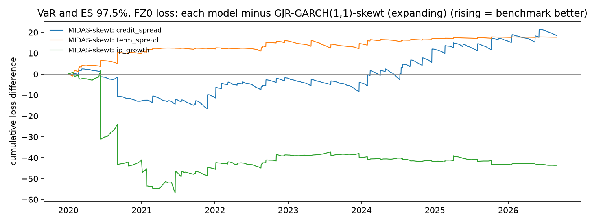

# Model comparison: locked test period

1,674 one-day-ahead forecasts per model (2020-01-02 to 2026-08-31). Lower loss is better. Diebold-Mariano (DM) tests compare each model with the benchmark, **GJR-GARCH(1,1)-skewt (expanding)**, using Newey-West standard errors; a positive DM t means the model has higher loss than the benchmark. The Model Confidence Set (MCS, 90%) uses a stationary bootstrap with mean block length 10 and 10,000 replications. This is the one-time evaluation on the locked test period, with every setting fixed during development.

## Summary

Rank by average loss; * marks models in the 90% MCS.

| model | VaR 99.0%, tick loss | VaR 97.5%, tick loss | VaR and ES 97.5%, FZ0 loss | variance, QLIKE vs gk_overnight | variance, QLIKE vs sq_ret | variance, QLIKE vs parkinson | variance, MSE vs gk_overnight |
|---|---|---|---|---|---|---|---|
| MIDAS-skewt: ip_growth | 1 * | 1 * | 1 * | 1 * | 1 * | 2 | 2 * |
| GJR-GARCH(1,1)-skewt (expanding) | 2 * | 3 * | 2 * | 2 * | 2 * | 4 | 4 * |
| MIDAS-skewt: term_spread | 4 * | 4 * | 3 * | 4 | 4 * | 3 | 3 * |
| MIDAS-skewt: credit_spread | 3 * | 2 * | 4 * | 3 | 3 * | 1 * | 1 * |

## VaR 99.0%, tick loss

| model | mean loss | rank | vs benchmark | DM t | DM p | MCS p | in MCS |
|---|---|---|---|---|---|---|---|
| MIDAS-skewt: ip_growth | 0.0403 | 1 | -1.69% | -1.0702 | 0.2845 | 1.0000 | yes |
| GJR-GARCH(1,1)-skewt (expanding) | 0.0410 | 2 | +0.00% | n/a | n/a | 0.2446 | yes |
| MIDAS-skewt: credit_spread | 0.0413 | 3 | +0.55% | 0.6513 | 0.5148 | 0.1965 | yes |
| MIDAS-skewt: term_spread | 0.0413 | 4 | +0.70% | 1.8181 | 0.0691 | 0.1965 | yes |

## VaR 97.5%, tick loss

| model | mean loss | rank | vs benchmark | DM t | DM p | MCS p | in MCS |
|---|---|---|---|---|---|---|---|
| MIDAS-skewt: ip_growth | 0.0786 | 1 | -0.26% | -0.3917 | 0.6953 | 1.0000 | yes |
| MIDAS-skewt: credit_spread | 0.0788 | 2 | -0.05% | -0.1056 | 0.9159 | 0.8808 | yes |
| GJR-GARCH(1,1)-skewt (expanding) | 0.0788 | 3 | +0.00% | n/a | n/a | 0.8808 | yes |
| MIDAS-skewt: term_spread | 0.0790 | 4 | +0.28% | 1.3846 | 0.1662 | 0.3612 | yes |

## VaR and ES 97.5%, FZ0 loss

| model | mean loss | rank | vs benchmark | DM t | DM p | MCS p | in MCS |
|---|---|---|---|---|---|---|---|
| MIDAS-skewt: ip_growth | 1.0995 | 1 | -2.32% | -1.1028 | 0.2701 | 1.0000 | yes |
| GJR-GARCH(1,1)-skewt (expanding) | 1.1256 | 2 | +0.00% | n/a | n/a | 0.2314 | yes |
| MIDAS-skewt: term_spread | 1.1362 | 3 | +0.94% | 2.0211 | 0.0433 | 0.2314 | yes |
| MIDAS-skewt: credit_spread | 1.1366 | 4 | +0.98% | 0.8692 | 0.3847 | 0.2314 | yes |

## variance, QLIKE vs gk_overnight

| model | mean loss | rank | vs benchmark | DM t | DM p | MCS p | in MCS |
|---|---|---|---|---|---|---|---|
| MIDAS-skewt: ip_growth | 0.9613 | 1 | -1.00% | -1.1889 | 0.2345 | 1.0000 | yes |
| GJR-GARCH(1,1)-skewt (expanding) | 0.9711 | 2 | +0.00% | n/a | n/a | 0.2458 | yes |
| MIDAS-skewt: credit_spread | 0.9768 | 3 | +0.59% | 1.2436 | 0.2137 | 0.0705 | no |
| MIDAS-skewt: term_spread | 0.9811 | 4 | +1.03% | 3.9276 | 8.6e-05 | 0.0705 | no |

## variance, QLIKE vs sq_ret

| model | mean loss | rank | vs benchmark | DM t | DM p | MCS p | in MCS |
|---|---|---|---|---|---|---|---|
| MIDAS-skewt: ip_growth | 0.9749 | 1 | -2.85% | -1.3469 | 0.1780 | 1.0000 | yes |
| GJR-GARCH(1,1)-skewt (expanding) | 1.0035 | 2 | +0.00% | n/a | n/a | 0.1594 | yes |
| MIDAS-skewt: credit_spread | 1.0078 | 3 | +0.43% | 0.4822 | 0.6297 | 0.1580 | yes |
| MIDAS-skewt: term_spread | 1.0154 | 4 | +1.19% | 2.6812 | 0.0073 | 0.1580 | yes |

Note: Squared returns are unbiased but very noisy, so differences are harder to detect.

## variance, QLIKE vs parkinson

| model | mean loss | rank | vs benchmark | DM t | DM p | MCS p | in MCS |
|---|---|---|---|---|---|---|---|
| MIDAS-skewt: credit_spread | 0.5396 | 1 | -5.17% | -7.5208 | 5.4e-14 | 1.0000 | yes |
| MIDAS-skewt: ip_growth | 0.5614 | 2 | -1.35% | -1.2363 | 0.2163 | 0.0101 | no |
| MIDAS-skewt: term_spread | 0.5667 | 3 | -0.42% | -1.2735 | 0.2028 | 0.0101 | no |
| GJR-GARCH(1,1)-skewt (expanding) | 0.5691 | 4 | +0.00% | n/a | n/a | 0.0001 | no |

Note: Parkinson misses the overnight move (it captures about two-thirds of close-to-close variance), so it is biased low and QLIKE on it favours models that under-forecast. Kept because it was pre-registered; interpret with caution.

## variance, MSE vs gk_overnight

| model | mean loss | rank | vs benchmark | DM t | DM p | MCS p | in MCS |
|---|---|---|---|---|---|---|---|
| MIDAS-skewt: credit_spread | 19.8 | 1 | -2.43% | -1.2283 | 0.2193 | 1.0000 | yes |
| MIDAS-skewt: ip_growth | 20.1 | 2 | -0.80% | -1.3869 | 0.1655 | 0.2125 | yes |
| MIDAS-skewt: term_spread | 20.3 | 3 | -0.08% | -0.1240 | 0.9013 | 0.1315 | yes |
| GJR-GARCH(1,1)-skewt (expanding) | 20.3 | 4 | +0.00% | n/a | n/a | 0.1989 | yes |

Note: MSE is dominated by a few crisis days, so it is less informative than QLIKE.

The MCS implementation reproduces the `arch` package's MCS(method="max") exactly when given the same bootstrap draws (see tests/test_evaluation.py).

