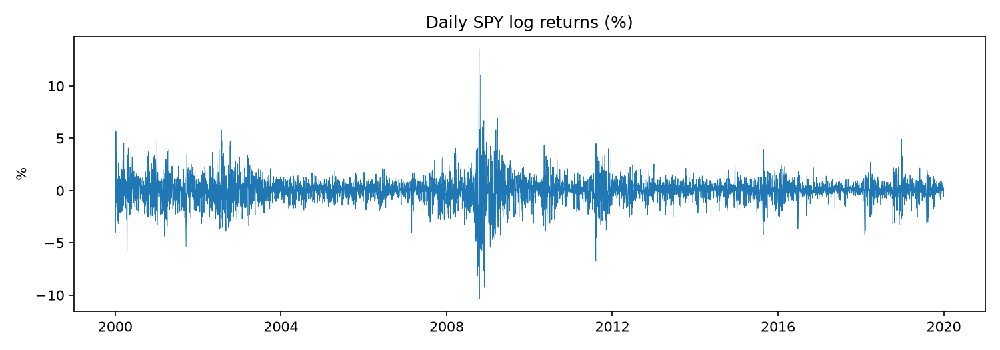
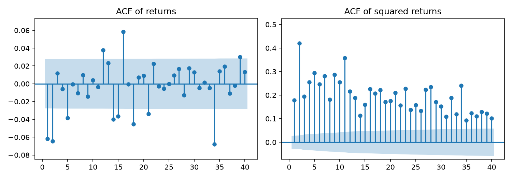
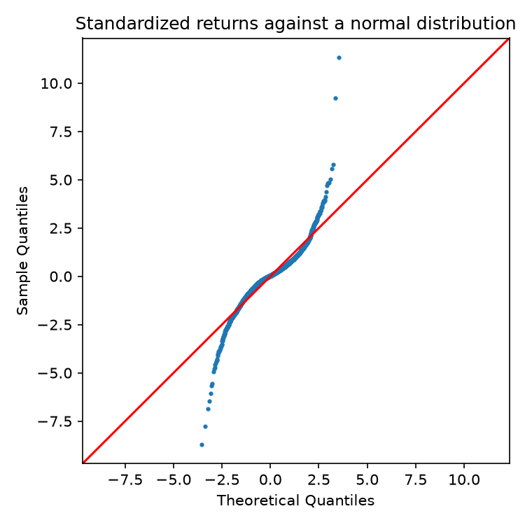

# Stylized facts of daily SPY returns

Sample: 2000-01-04 to 2019-12-31 (5,030 daily log returns, in percent). The locked test period is excluded.

## Distribution

|  | value |
|---|---|
| mean (% per day) | 0.0232 |
| t-statistic of mean | 1.3802 |
| standard deviation (% per day) | 1.1946 |
| annualized volatility (%) | 19.0 |
| skewness | -0.0731 |
| excess kurtosis | 10.6 |
| Jarque-Bera statistic | 23,560.3 |
| Jarque-Bera p-value | 0 |

### Tail events versus a normal distribution

| beyond k std devs | observed | expected_if_normal | ratio |
|---|---|---|---|
| 3 | 83 | 13.6 | 6.1119 |
| 4 | 28 | 0.3186 | 87.9 |
| 5 | 12 | 0.0029 | 4,161.3 |

## Dependence

### Autocorrelations

| lag | returns | squared returns | absolute returns |
|---|---|---|---|
| 1 | -0.0617 | 0.1790 | 0.2678 |
| 5 | -0.0386 | 0.2958 | 0.3391 |
| 10 | 0.0042 | 0.2562 | 0.3056 |
| 20 | 0.0091 | 0.1761 | 0.2416 |

### Ljung-Box p-values

The test assumes constant variance, so for returns it can reject too often when volatility clusters. The robust test below corrects for this.

| up to lag | returns | squared returns |
|---|---|---|
| 5 | 3.1e-09 | 0 |
| 10 | 2.2e-07 | 0 |
| 20 | 2.8e-13 | 0 |

### Return autocorrelation with heteroskedasticity-robust t-statistics

| lag | coefficient | robust_t | p_value |
|---|---|---|---|
| 1 | -0.0617 | -2.4931 | 0.0127 |
| 2 | -0.0643 | -1.8657 | 0.0621 |
| 5 | -0.0384 | -1.2405 | 0.2148 |

### ARCH-LM test (5 lags)

Statistic 1173.9, p-value 1.3e-251.

## Asymmetry (leverage effect)

Average next-day variance (`gk_overnight`) after down days versus up days. A symmetric model implies a ratio of 1.

| days compared | n_down | n_up | next_var_after_down | next_var_after_up | ratio |
|---|---|---|---|---|---|
| all days | 2,277 | 2,733 | 1.7959 | 1.1923 | 1.5063 |
| moves larger than 1 | 683 | 684 | 3.6309 | 2.1804 | 1.6652 |

Correlation between today's return and tomorrow's variance proxy: -0.147.

## Figures

